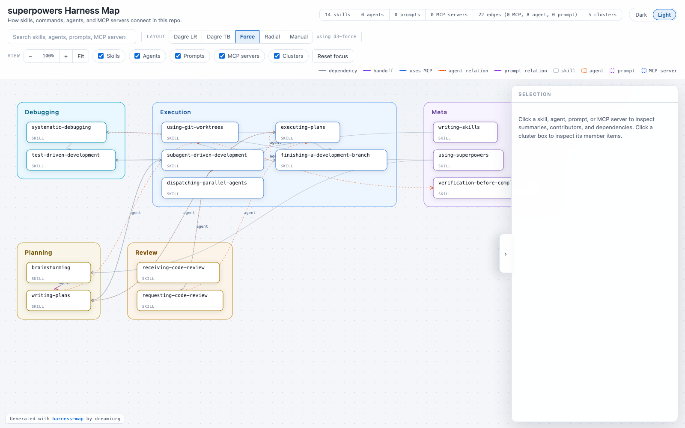

# harness-map

An [Agent Skill](https://agentskills.io) that generates a **self-contained, interactive HTML
dependency map** of a repository's AI harness: skills, commands, agents, and MCP servers —
which skills hand off to which, which agents they delegate to, which MCP servers everything uses.

*(Generated from the public [obra/superpowers](https://github.com/obra/superpowers) repo —
14 skills, 22 evidence-backed edges, auto-clustered.
Interactive version: [examples/superpowers.html](examples/superpowers.html).)*

Deterministic scripts scan the repo and build the HTML; the invoking agent does the one thing
scripts can't — reading each skill/agent body and inferring typed, evidence-backed dependency edges.

## Install

    npx skills add dreamiurg/harness-map

Or as a Claude Code plugin:

    /plugin marketplace add dreamiurg/harness-map
    /plugin install harness-map@harness-map-marketplace

## Use

Ask your agent: "map my AI harness" or invoke `/harness-map`. Output: `harness-map.html`
(single file, fully offline, open in any browser).

## License

MIT
